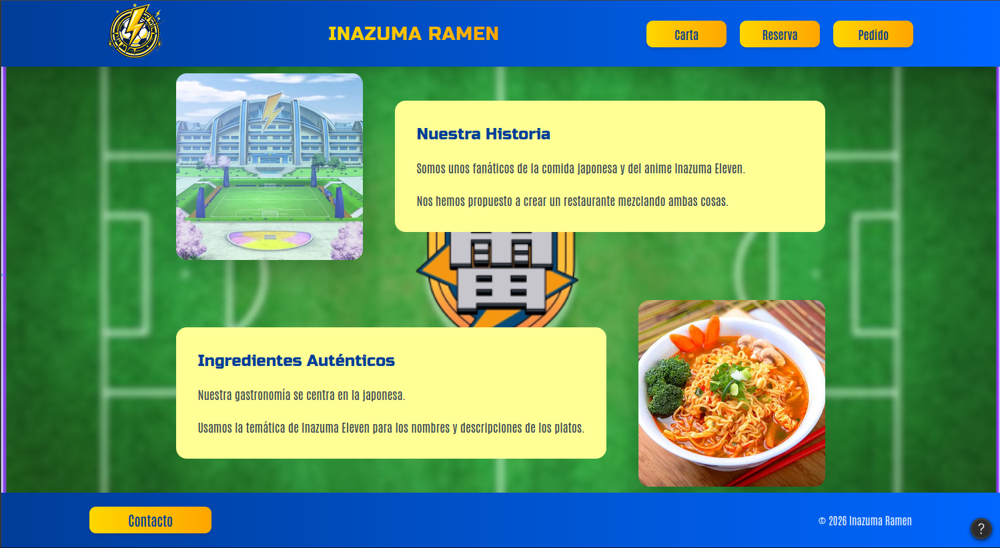
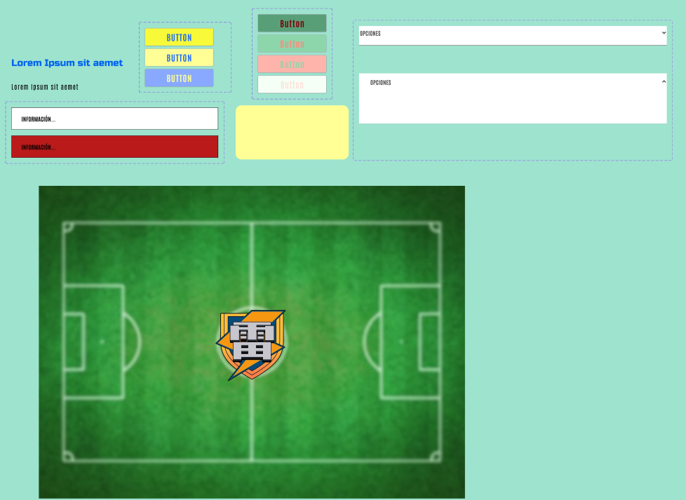
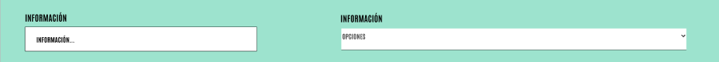
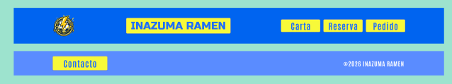
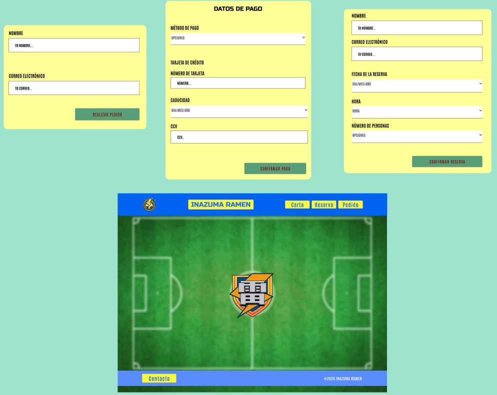

# DIU - Practica 3, entregables

- Moodboard (diseño visual + logotipo)   
- Landing Page
- Mockup: LAYOUT HI-FI
- Publicación del Case Study

## MOODBOARD

Definimos el siguiente moodboard . 

En él, establecemos: la estrategia, el logo del restaurante orientado en Inazuma Eleven, la paleta de colores utilizada, la tipografía, la frase motivadora con inspiración en una frase mítica de la serie y tanto las imagenes nuestras que queremos transmitir como las motivadoras y comentarios de usuarios.

## LANDING PAGE

Hemos diseñado este 

Hemos utilizado como herramienta de apoyo FIGMA MAKE. A través de un Wireframe Dinámico de la página principal que hicimos en la práctica pasada, creamos este Landing Page para darnos a conocer y trasnmitir la estética de Inazuma Eleven. Para la elaboración, le pedimos a FIGMA MAKE que usara la paleta de colores que se especifica en el MoodBoard, como fuente "Russo One" para los encabezados y títulos y la fuente "Antonio" para el resto, añadiera el logo pasado por nosotros arriba a la izquierda, ajustara las imagenes del main de la pagina, sustituyera el texto de lore ipsum por el que le pasamos nosotros y además añadiera la imagenes que le pasamos del campo futbol de Inazuma Eleven y el plato de ramen donde está el hueco para la imágen. También, que le pusiera un fondo amarillo al texto para que destaque y que actualizara el fondo con la imagen de un campo futbol visto desde arriba con el escudo del Raimon

## DESIGN SYSTEM
### GUIDELINESS
- Botones principales:
  - Tipografía: Antonio, todo mayúscula
  - Default: fondo #FDFF40, color de la tipografía #0064F0
  - Hover: cambiará ligeramente el fondo del botón
  - Click: se invertirán los colores de forma que el color del fondo pase a ser el del texto y el color del texto pase a ser el del fondo

- Botones secundarios:
  - Tipografía: Antonio, todo mayúscula
  - Default: fondo #519872, tipografía #BB4430
  - Hover: cambiará ligeramente el fondo del botón
  - Click: se invertirán los colores de forma que el color del fondo pase a ser el del texto y el color del texto pase a ser el del fondo
  - Disabled: estará desactivado si hay campos sin rellenar, se mostrarán tonos más grisáceos de la paleta.
    
- Etiqueta:
    - Forma: rectángulo o cuadrado con esquinas redondeadas
    - Tono:  #FDFF40
- Tipografía:
    - Titulos: tipografía Russo One para que resalten más y ayude al cliente a detectar con facilidad la información que está buscando.
    - Texto: tanto para las páginas como para los botones se usará Antonio.
    - Tamaño: Para el título principal sea de 36 y para los subtítulos (Texto que aparece arriba de los campos de texto) y lo demás, no hay un tamaño fijo establecido depende de como quede     visualmente pero para una pagina, dos elementos iguales tienen el mismo tamaño.
- Layout:
    - Para la distribución de la página se usará un grid de 12 columnas. Y los contenedores deben expandirse ajustando cada ítem del interior de forma equitativa o tener scroll para solventar problemas de escalabilidad y  la información importante debe quedar siempre a la vista. 
- Campo de texto:
    - Forma: Será un rectángulo de fondo blanco.
    - Contenido y Tipografía:  se mostrará un mensaje en mayúscula usando la tipografía Antonio con la información con la que debe rellenarse.
    - Excepción: Si el campo estuviera mal rellenado al pulsar el botón correspondiente se pondrá el fondo rojo.
- Desplegable::
    - Forma: Será un rectángulo de fondo blanco que al pulsar sobre él se mostrarán las opciones disponibles.
    - Contenido y Tipografía: se mostrará un mensaje en minúscula usando la tipografía Antonio con la información con la que debe rellenarse.
    - Excepción: Si no se pudiera realizar la acción con los datos introducidos se pondrá el fondo rojo al pulsar el botón correspondiente.
- Imágenes:
    - Forma: Las imágenes tendrán las esquinas redondeadas c
    - Dimensiones: Para la pagina de reseña y pedido 410x410. Para la página de principal 300 x 300.
### Atómos 

### Moléculas

### Organismos

### Patrones

## LAYOUT HI-FI
A partir del Desyng System descrito en el punto anterior, hemos creado nuestra página web con una navegación funcional. 

[Layout Hi-Fi](https://www.figma.com/proto/ljIgCD8RiohaodkAQ13woq/P%C3%A1gina?node-id=13-220&t=cEnkApVzRIxNLJwP-1&scaling=scale-down&content-scaling=fixed&page-id=0%3A1&starting-point-node-id=13%3A220)

## BRIEFING
Es la práctica que más nos ha gustado hasta el momento. Hemos comenzado definiendo nuestro moodboard donde lo que más nos costó es encontrar imágenes que representáran lo que queríamos transmitir. Seguidamente, realizamos el Landing Page gracias a Figma Make, ceando una página principal base que representara nuestras ideas orientadas a Inazuma Eleven. Una vez hecho esto, definimos unos guidelines. Y después, hicimos los componentes básicos a partir de dichas indicaciones (Guidelines). Para finalizar, construimos nuestra página usando los componentes (átomos, móleculas, órganimos y patrones), destacando el scroll en la página de carta y  unos mensajes a modo de pop up al realizar la reserva o el pago.
