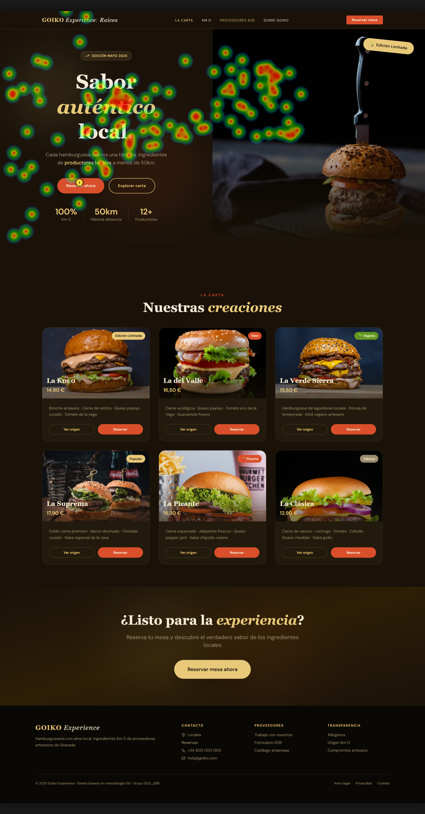
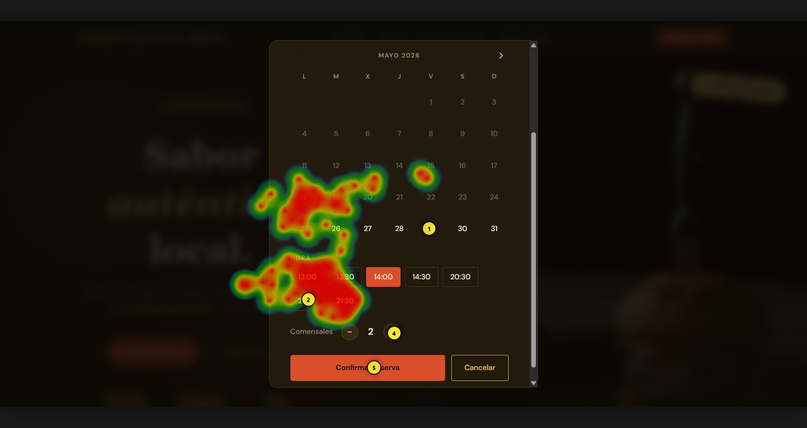
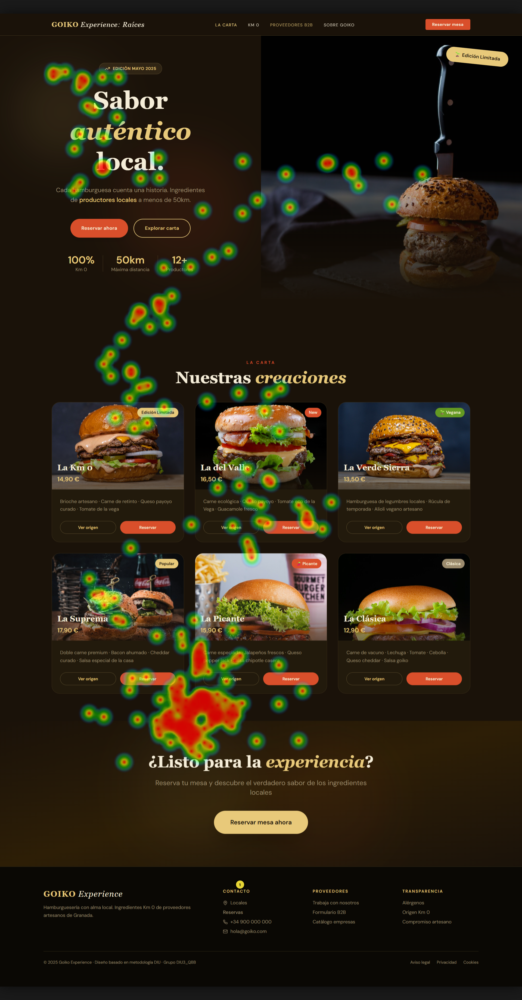
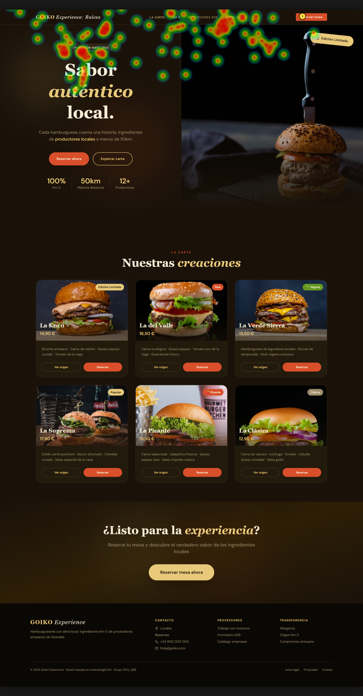
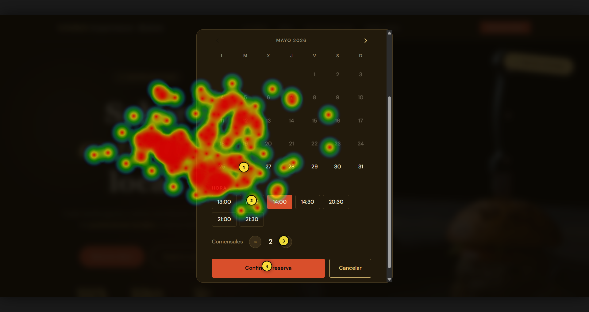
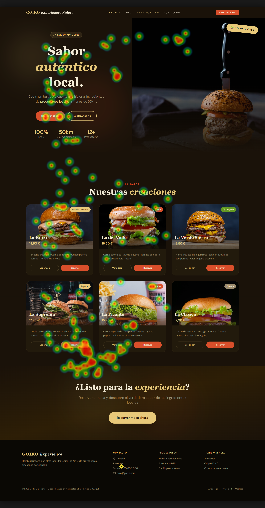
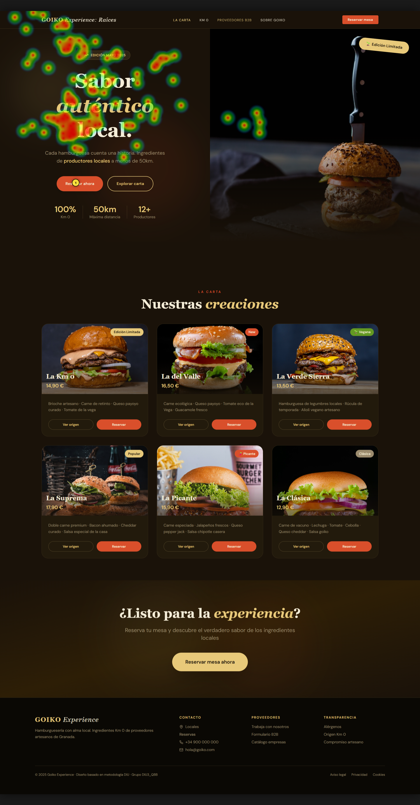
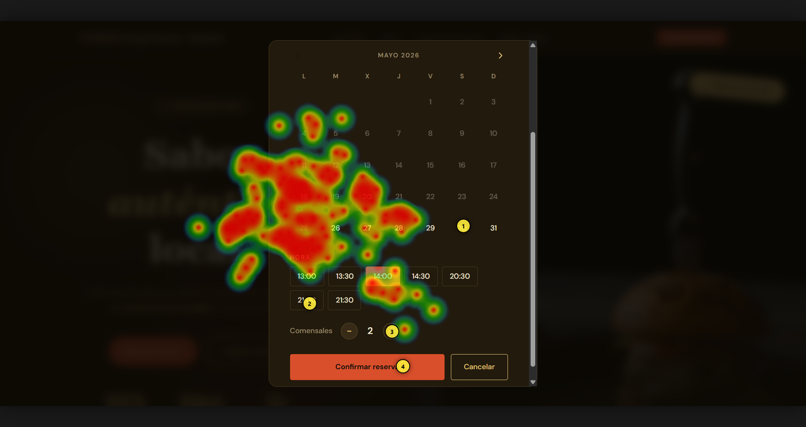
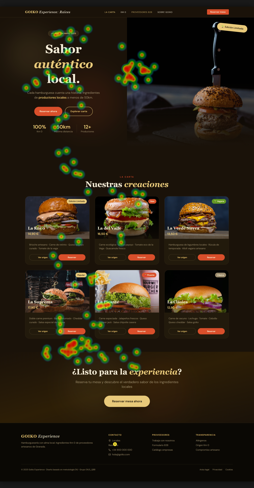

# Usability Report

### Evaluación de usabilidad del proyecto  Goiko Experience: Optimización de la Carta y Flujos de Conversión

30/05/2026

[Enlace al Github](https://github.com/DIU3-QBB/UX_CaseStudy)

### Realizado por:  

DIU1.Los_visionarios

## 1 RESUMEN EJECUTIVO  (Executive Summary)

Hemos la página web de Goiko Experience con el objetivo de analizar que la usabilidad y la accesibilidad sean adecuadas para el usuario.

Para ello hemos hecho un test A/B, donde hemos puesto a varios usuarios a realizar acciones tanto en nuestra página, Inazuma Ramen, como en la de Goiko
Experience para tener una comparación. Hemos hecho un test SUS para tener una puntuación numérica y hemos realizado un Eye Tracking para obtener los respectivos
mapas de calor de la página.

Los tres puntos más críticos encontrados son los siguientes:
- El botón de reserva del header es ignorado debido a su posición y a la gran cantidad de botones de reserva mejor posicionados y más vistosos.
- La página web es muy larga, se invierte mucho tiempo en encontrar el contacto.
- El contraste de los botones de reserva es bajo, limitando a ciertos usuarios.

La puntuación media final del cuestionario SUS es de 84.25 puntos, lo que lo hace ser una página web aceptable.

## 2. Metodología y Reclutamiento

Para las pruebas hemos reclutado a los siguientes participantes:

| ID Participante | Edad | Género | Competencia digital | Gafas/Lentillas | Iluminación | Resolución | Conocimiento previo | Rol |
|---|---|---|---|---|---|---|---|---|
| P01 | 21 | Hombre | Alta | Si | Natural | 1920x1080 | Medio | Estudiante |
| P02 | 20 | Hombre | Alta | No | Natural | 1920x1080 | Medio | Estudiante |
| P03 | 20 | Hombre | Alta | Si | Natural | 1920x1080 | Medio | Estudiante |
| P04 | 20 | Mujer | Media | No | Natural | 1920x1080 | NInguno | Estudiante |
| P05 | | | | | | | | |
| P06 | 19 | Mujer | Alta | No | Natural | 1920x1080 | Ninguno | Estudiante |
| P07 | 20 | Hombre | Alta | No | Artificial | 1920x1080 | Ninguno | Estudiante |
| P08 | 21 | Mujer | Media | Si | Artificial | 1920x1080 | Ninguno | Estudiante |
| P09 | 53 | Mujer | Baja | Si | Natural | 1920x1080 | Ninguno | Enfermera |
| P10 | 14 | Hombre | Alta | No | Natural | 1920x1080 | Ninguno | Estudiante |

A los participantes se le asignaron las siguientes pruebas:
- Realizar una reserva
- Consultar el contacto

Hemos usado la herramienta GazeMapping para poder extraer sus datos de visión y los clicks hechos, representados en un mapa de calor,  durante la 
realización de las pruebas. 

## 3. Resultados del Cuestionario SUS (Datos Cuantitativos)

Para la realización del cuestionario SUS hemos hecho las siguientes preguntas:

|      | PREGUNTAS                                                    |
| ---- | ------------------------------------------------------------ |
| 1    | Creo que me gustará visitar con frecuencia este website      |
| 2    | Encontré el website innecesariamente complejo                |
| 3    | Pensé que era fácil utilizar este website                    |
| 4    | Creo que necesitaría del apoyo de un experto para recorrer el website |
| 5    | Encontré las funciones del website bastante bien integradas  |
| 6    | Pensé que había demasiada inconsistencia en el website       |
| 7    | Imagino que la mayoría de las personas aprenderían muy rápidamente a utilizar el website |
| 8    | Encontré el website muy grande al recorrerlo                 |
| 9    | Me sentí muy confiado en el manejo del website               |
| 10   | Necesito aprender muchas cosas antes de manejarse en el website |

Y hemos obtenido los siguientes resultados:

#### Test realización de reserva

| Id participante | Tiempo empleado | P1 | P2 | P3 | P4 | P5 | P6 | P7 | P8 | P9 | P10 | Resultado |
|---|---|---|---|---|---|---|---|---|---|---|---|---|
| **TEST A** | | | | | | | | | | | | |
| P01 | 16.00 | 5 | 1 | 5 | 1 | 5 | 1 | 5 | 1 | 5 | 1 | 100 |
| P02 | 20.00 | 5 | 1 | 5 | 1 | 5 | 1 | 5 | 1 | 5 | 1 | 100 |
| P03 | 23.00 | 5 | 1 | 5 | 1 | 4 | 1 | 5 | 1 | 5 | 1 | 97,5 |
| P04 | 35.00 | 5 | 1 | 5 | 1 | 5 | 2 | 5 | 1 | 5 | 1 | 97,5 |
| P05 | 15.00 | 4 | 1 | 5 | 1 | 5 | 1 | 5 | 1 | 5 | 1 | 97,5 |
| **TEST B** | | | | | | | | | | | | |
| P06 | 15.00 | 4 | 1 | 5 | 1 | 5 | 1 | 5 | 1 | 5 | 1 | 97,5 |
| P07 | 10.00 | 5 | 1 | 5 | 1 | 5 | 1 | 5 | 1 | 5 | 1 | 100 |
| P08 | 17.00 | 4 | 1 | 5 | 1 | 5 | 1 | 5 | 1 | 5 | 1 | 97,5 |
| P09 | 29.00 | 5 | 3 | 5 | 2 | 3 | 1 | 5 | 3 | 3 | 1 | 77,5 |
| P10 | 21:18 | 5 | 1 | 5 | 1 | 5 | 1 | 4 | 2 | 5 | 1 | 95 |

El diseño A ha tenido una media de 98,5 y el diseño B una media de 93,5.

#### Test consultar el contacto

| Id participante | Tiempo empleado | P1 | P2 | P3 | P4 | P5 | P6 | P7 | P8 | P9 | P10 | Resultado |
|---|---|---|---|---|---|---|---|---|---|---|---|---|
| **TEST A** | | | | | | | | | | | | |
| P01 | 7.00 | 5 | 1 | 5 | 1 | 5 | 1 | 5 | 1 | 5 | 1 | 100 |
| P02 | 9.00 | 5 | 1 | 5 | 1 | 5 | 1 | 5 | 1 | 5 | 1 | 100 |
| P03 | 15.00 | 5 | 2 | 5 | 1 | 4 | 1 | 5 | 1 | 5 | 1 | 95 |
| P04 | 25.00 | 4 | 2 | 5 | 1 | 5 | 2 | 4 | 1 | 4 | 1 | 87,5 |
| P05 | 14.90 | 5 | 1 | 5 | 1 | 5 | 2 | 5 | 1 | 5 | 1 | 97,5 |
| **TEST B** | | | | | | | | | | | | |
| P06 | 23.00 | 2 | 1 | 4 | 1 | 5 | 1 | 2 | 1 | 5 | 1 | 82,5 |
| P07 | 13.00 | 4 | 1 | 5 | 1 | 5 | 1 | 5 | 2 | 5 | 1 | 95 |
| P08 | 27.00 | 3 | 2 | 3 | 1 | 5 | 1 | 5 | 3 | 5 | 1 | 82,5 |
| P09 | 1:24 | 3 | 5 | 5 | 5 | 1 | 5 | 5 | 5 | 1 | 5 | 25 |
| P10 | 11.09 | 5 | 1 | 3 | 1 | 5 | 1 | 4 | 2 | 5 | 1 | 90 |

El diseño A ha tenido una media de 96 y el diseño B una media de 75.

### Desglose por ítems

El punto más perjudicial es que los usuarios encontraron la página demasiado larga, sobre todo para encontrar la información del contacto.
El segundo punto ha sido que ciertos usuarios han encontrado el sitio web un poco complejo.

### Valoración numérica del SUS - 84,25

## 4. Análisis de Eye Tracking (Datos Biométricos)

### Heatmaps

#### POI

#### Resultados P06 prueba 1

#### Resultados P06 prueba 2

#### Resultados P07 prueba 1

#### Resultados P07 prueba 2

#### Resultados P08 prueba 1

#### Resultados P08 prueba 2

- **Heatmaps (Mapas de calor):** Incluye las capturas de GazeMapping. Comenta si los usuarios miraron los **POI** (Puntos de Interés) definidos.
### Zonas de silencio
El header es prácticamente ignorado, sobre todo el botón de reservar mesa, debido a que no destaca respecto del fondo de la página y los enlaces son de colores muy
claros, con una letra pequeña, haciendo que no destaquen.

### Hallazgo
El 80% de los usuarios ignoró el header.

## 5. Auditoría de Accesibilidad

Sintetiza el cumplimiento técnico y normativo.

### Puntuación automática: 91/100 (Lighthouse)

### Barreras
- Bajo contraste en los botones de reserva, los usuarios con visión baja no pueden identificar la acción principal.
- El texto alternativo es rendundante en imágenes, los usuarios se ven obligados a ver la misma información dos veces, generando una
navegación tediosa, confusa y lenta.
- Falta de etiqueta en el buscador, los usuarios pueden no estar seguros de qué información se espera que introduzcan ahí.

## 6. Conclusiones y Recomendaciones (Actionable Insights)

Estas han sido las conclusiones a las que hemos llegado tras realizar nuestra investigación:

| **Prioridad**      | **Hallazgo**                                                 | **Recomendación de Mejora**                                  |
| ------------------ | ------------------------------------------------------------ | ------------------------------------------------------------ |
| **Crítica** |Bajo contraste en los botones de reserva | Cambiar el color del texto de naranja claro a negro |
| **Alta** |Texto alternativo redundante en imágenes | Poner una descripción más detallada en el texto alternativo de las imágenes |
| **Alta** |Falta de etiqueta en el buscador | Añadir una etiqueta en el buscador con la información a introducir |
| **Media**          | El header es ignorado       | Cambiar el color del header y de sus elementos para que destaquen más |
| **Media**           | La página es demasiado larga                               | Poner la carta en una sección aparte en vez de tenerla en la página principal|

