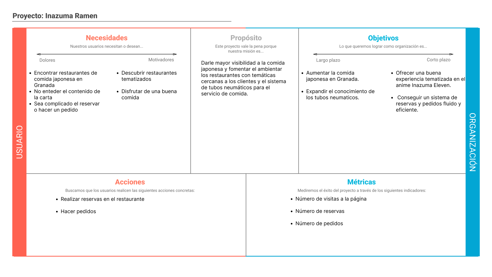
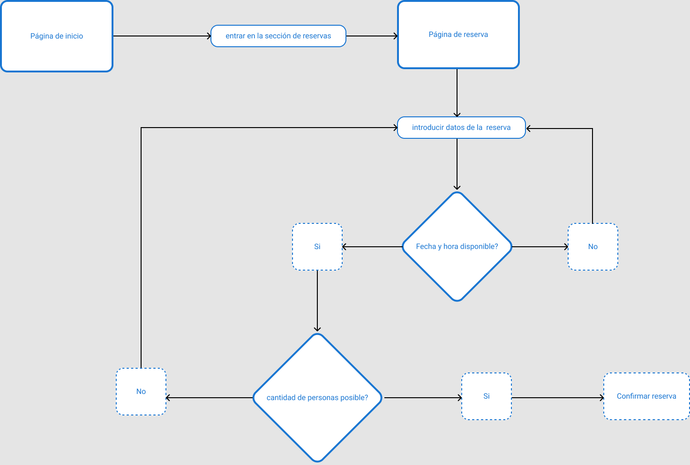
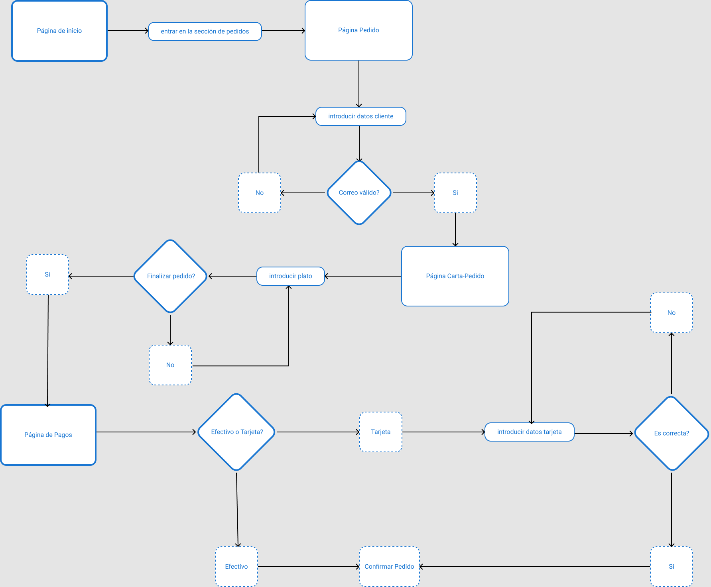
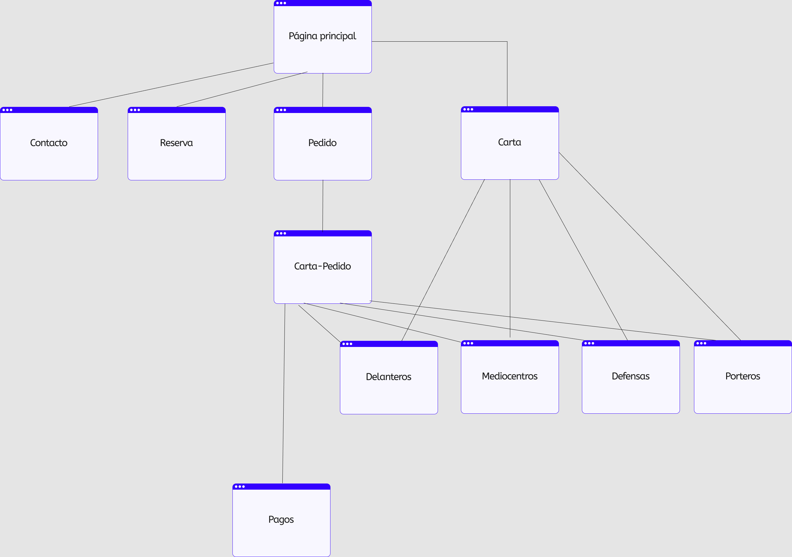

# DIU26
Prácticas Diseño Interfaces de Usuario (Tema: .... ) 

* [Guiones de prácticas](GuionesPracticas/)
* [Guía para crea tu Case Study](Guia_CaseStudy.md)
* Sala de la Fama [DIU Hall of fame](https://github.com/mgea/DIU/tree/master/hall_of_fame) donde se pueden encontrar Case Study destacados de otros años.
* [Recursos/plantillas en figma](https://www.figma.com/design/BN2IR0q2clOSplfMmalh9K/DIU_Toolkit_Framework--2026-)

Actualizado: 14/01/2026

## Paso 0 My UX-Case Study
 
-----
Grupo: DIU1.Los_visionarios.  Curso: 2025/26 

Nombre del Proyecto: Inazuma Ramen

Descripción: Restaurante de comida japonesa inspirado en el anime Inazuma Eleven

Logotipo: 

Miembros y nombre del equipo:
 * :bust_in_silhouette:  [Carlos Romero García](https://github.com/Cromgar939)   :octocat:     
 * :bust_in_silhouette:  [Manuel Martín Rodríguez](https://github.com/ManuelMR2114)     :octocat:

 

# Proceso de Diseño 

 

## Paso 1. UX User & Desk Research & Analisis 

### 1.a User Reseach Plan
 
-----
Queremos hacer un restaurante de comida japonesa inspirado en el anime Inazuma Eleven, utilizando un sistema de tubos neumáticos para la entrega de comida y ambientando el local y los platos en la serie. 

Hemos investigado la página de Sibuya para basarnos en su diseño. Nuestros objetivos se basan en satisfacer todas las necesidades del usuario de forma que no le resulte complicado entender la interfaz. Para ello vamos a investigar la experiencia de los usuarios relizando pedidos online y sobre el sistema de tubos neumáticos.

Para la investigación buscaremos usuarios mayores de edad y les pediremos que realicen tareas simples como realizar una reserva, realizar un pedido y pedir dentro del restaurante mediante el escaneo de un código QR.

### 1.b Competitive Analysis
 
-----
[Competitive Analysis](P1/CompetitorAnalysis.png)

Tras comparar la página web de Sibuya con la nuestra, la de Sibuya ofrece una experiencia tradicional mientras que la nuestra tiene un flujo guiado y una información concisa de forma que reduce la carga para el cliente. Queremos que todas las opciones a las que el usuario acceda recurrentemente (carta, reserva, pedido) estén en la página principal y sea fácilmente reconocibles, al contrario que la carta en Sibuya que se encuentra en un menú lateral un poco oculto.

### 1.c Personas
 
-----

[Persona 1: Evaristo González](P1/Persona1.png). Es un joven que maneja a la perfección internet y fan del anime que busca una experiencia orientada en sus serires favoritas para compartir con amigos.

[Persona 2: Alejandra Ortega](P1/Persona2.png). Una madre con poco manejo digital y su prioridad es la eficiencia y la claridad para que todo salga correctamente.

### 1.d User Journey Map
 
----

Para el [User Journey Map de Evaristo](P1/UserJourneyMapPersona1.jpg) hemos decidio poner la situación de una reserva, algo que es muy común en restaurantes.

Para el [User Journey Map de Alejandra](P1/UserJourneyMapPersona2.jpg) hemos decidido poner la situación de un pedido, cosa que es bastante común hoy en día.

### 1.e Usability Review
 
----

[Usability review](P1/Usability-review.pdf)

URL: https://sibuyaurbansushibar.com/restaurante-japones-granada/

Valoración: 89/100 -> Good

Puntos fuertes: colores impactantes, iconos reconocibles e instrucciones claras.

Puntos débiles: errores, menú lateral y función de búsqueda.

 

## Paso 2. UX Design  

### 2.a Reframing / IDEACION: Feedback Capture Grid / EMpathy map 
 
----
A partir del análisis de Sibuya en la P1, elaboramos una [Malla Receptora de Información](P2/feedbackCaptureGrid.png) y un [Mapa de Empatía](P2/EmpathyCustomerMapShibuya.png). Con esto, nos ponemos en los zapatos de nuestros clientes y sacamos que Shibuya presenta un diseño profesional, buena combinación de colores y una buena explicación de todo el contenido pero presenta una serie de desventajas: una carta cuya posición en la página web no es muy buena y sin precios visibles, buscador sin tolerancia a errores ortográficos, un límite de personas al realizar una reserva bastante reducido y datos que introducimos en la página no se quedan guardados en caso de error.

 Interesante | Críticas     
| ------------- | -------
  Preguntas | Nuevas ideas
  
Por lo tanto, Los usuarios abandonan el proceso de reserva o pedido por las desventajas comentadas antes. Nuestra propuesta consiste en crear una página web para Inazuma Ramen de forma que sea lo más sencilla de utilizar para el usuario. Nos centraremos en que toda la infomarción importante se muestre en todo momento y que las instrucciones para reservar y para realizar pedidos sean lo más claras posibles. Nos basaremos sobre todo en el número de reservas y de pedidos para comprobar si vamos por buen camino.

### 2.b ScopeCanvas

----

### 2.b User Flow (task) analysis 
 
-----
Hemos modelado dos operaciones principales que puede realizar el cliente:

**Primer Task Flow** — el usuario selecciona fecha, hora y número de personas. 
Si la reserva es posible se confirma; si no, se muestra un mensaje de error 
con el motivo.

**Segundo Task Flow** — el usuario introduce sus datos, recorre la carta añadiendo 
platos y finaliza seleccionando el método de pago. Si elige tarjeta, se validan 
los datos introducidos.

### 2.c IA: Sitemap + Labelling 
 
----
Con todo lo explicado en los puntos anteriores hemos creado nuestro sitemap

# Labelling
Término | Significado
| ------------- | -------
Pagina Principal | Página de inicio de Inazuma Ramen con acceso a las distintas secciones
Carta | Página para consular la carta
Pedido | Sección para realizar un pedido
Carta-Pedido| Página para consular la carta cuando el cliente vaya a realizar un pedido. 
Delanteros | Sección de la carta donde se encuentran los entrantes
Mediocentros | Sección de la carta donde se encuentran los platos principales
Defensas | Sección de la carta donde se encuentran los postres
Porteros | Sección de la carta donde se encuentran las bebidas
Pagos | Página para llevar a cabo el pago del pedido
Reserva | Página para realizar una reserva
Contacto | Sección donde se encuentra el correo y numero de teléfono de la empresa

### 2.d Wireframes
 
-----
Los wireframes han sido diseñados con **Figma** en dos versiones:

- [Wireframe fijo](P2/Wireframefijo.fig) con posiciones fijas absolutas y elementos en jerarquía de frames
- [Wireframe dinámico](P2/Wireframedinámico.fig) con un GRID LAYOUT con ajustes de diseño RESPONSIVE (Ordenador, Tablet y móvil)

Se han diseñado 6 pantallas principales: Página Principal, Carta, Reservas, Pedido, Pago y Contacto, teniendo en cuenta la aparición del teclado en tablet y móvil y el uso de la tablet en vertical y horizontal.

 

## Paso 3. Mi UX-Case Study (diseño)

>>> Cualquier título puede ser adaptado. Recuerda borrar estos comentarios del template en tu documento

### 3.a Moodboard

-----

>>> Diseño visual con una guía de estilos visual (moodboard) 
>>> Incluir Logotipo. Todos los recursos estarán subidos a la carpeta P3/
>>> Explique aqui la/s herramienta/s utilizada/s y el por qué de la resolución empleada. Reflexione ¿Se puede usar esta imagen como cabecera de Instagram, por ejemplo, o se necesitan otras?

### 3.b Landing Page
 
----

>>> Plantear el Landing Page del producto. Aplica estilos definidos en el moodboard

### 3.c Guidelines
 
----

>>> Estudio de Guidelines y explicación de los Patrones IU a usar 
>>> Es decir, tras documentarse, muestre las deciones tomadas sobre Patrones IU a usar para la fase siguiente de prototipado. 

### 3.d Mockup
 
----

>>> Consiste en tener un Layout en acción. Un Mockup es un prototipo HTML que permite simular tareas con estilo de IU seleccionado. Muy útil para compartir con stakeholders

 

## Paso 4. Pruebas de Evaluación 

### 4.a Reclutamiento de usuarios 

-----

>>> Breve descripción del caso asignado (llamado Caso-B) con enlace al repositorio Github
>>> Tabla y asignación de personas ficticias (o reales) a las pruebas. Exprese las ideas de posibles situaciones conflictivas de esa persona en las propuestas evaluadas. Mínimo 4 usuarios: asigne 2 al Caso A y 2 al caso B.

| Usuarios | Sexo/Edad     | Ocupación   |  Exp.TIC    | Personalidad | Plataforma | Caso
| ------------- | -------- | ----------- | ----------- | -----------  | ---------- | ----
| User1's name  | H / 18   | Estudiante  | Media       | Introvertido | Web.       | A 
| User2's name  | H / 18   | Estudiante  | Media       | Timido       | Web        | A 
| User3's name  | M / 35   | Abogado     | Baja        | Emocional    | móvil      | B 
| User4's name  | H / 18   | Estudiante  | Media       | Racional     | Web        | B 

### 4.b Diseño de las pruebas 
 
-----

>>> Planifique qué pruebas se van a desarrollar. ¿En qué consisten? ¿Se hará uso del checklist de la P1?

### 4.c Cuestionario SUS
 
----

>>> Como uno de los test para la prueba A/B testing, usaremos el **Cuestionario SUS** que permite valorar la satisfacción de cada usuario con el diseño utilizado (casos A o B). Para calcular la valoración numérica y la etiqueta linguistica resultante usamos la [hoja de cálculo](https://github.com/mgea/DIU19/blob/master/Cuestionario%20SUS%20DIU.xlsx). Previamente conozca en qué consiste la escala SUS y cómo se interpretan sus resultados
http://usabilitygeek.com/how-to-use-the-system-usability-scale-sus-to-evaluate-the-usability-of-your-website/)
Para más información, consultar aquí sobre la [metodología SUS](https://cui.unige.ch/isi/icle-wiki/_media/ipm:test-suschapt.pdf)
>>> Adjuntar en la carpeta P4/ el excel resultante y describa aquí la valoración personal de los resultados 

### 4.d A/B Testing
 
-----

>>> Los resultados de un A/B testing con 3 pruebas y 2 casos o alternativas daría como resultado una tabla de 3 filas y 2 columnas, además de un resultado agregado global. Especifique con claridad el resultado: qué caso es más usable, A o B?

### 4.e Aplicación del método Eye Tracking 

----

>>> Indica cómo se diseña el experimento y se reclutan los usuarios. Explica la herramienta / uso de gazerecorder.com u otra similar. Aplíquese únicamente al caso B.

  
>>> Cambiar esta img por una de vuestro experimento. El recurso deberá estar subido a la carpeta P4/  

>>> gazerecorder en versión de pruebas puede estar limitada a 3 usuarios para generar mapa de calor (crédito > 0 para que funcione) 

### 4.f Usability Report de B
 
-----

>>> Añadir report de usabilidad para práctica B (la de los compañeros) aportando resultados y valoración de cada debilidad de usabilidad. 
>>> Enlazar aqui con el archivo subido a P4/ que indica qué equipo evalua a qué otro equipo.

>>> Complementad el Case Study en su Paso 4 con una Valoración personal del equipo sobre esta tarea

 

## Paso 5. Exportación y Documentación 

### 5.a Exportación a HTML/React
 
----

>>> Breve descripción de esta tarea. Las evidencias de este paso quedan subidas a P5/

### 5.b Documentación con Storybook

----

>>> Breve descripción de esta tarea. Las evidencias de este paso quedan subidas a P5/

 

## Conclusiones finales & Valoración de las prácticas

>>> Opinión FINAL del proceso de desarrollo de diseño siguiendo metodología UX y valoración (positiva /negativa) de los resultados obtenidos. ¿Qué se puede mejorar? Recuerda que este tipo de texto se debe eliminar del template que se os proporciona 

