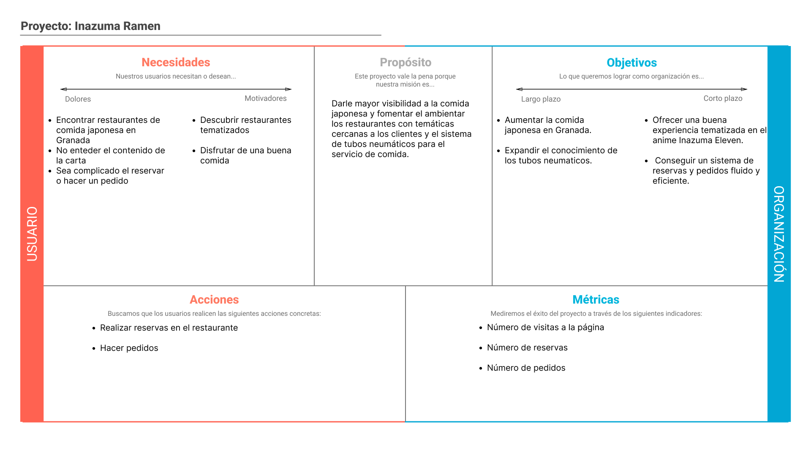
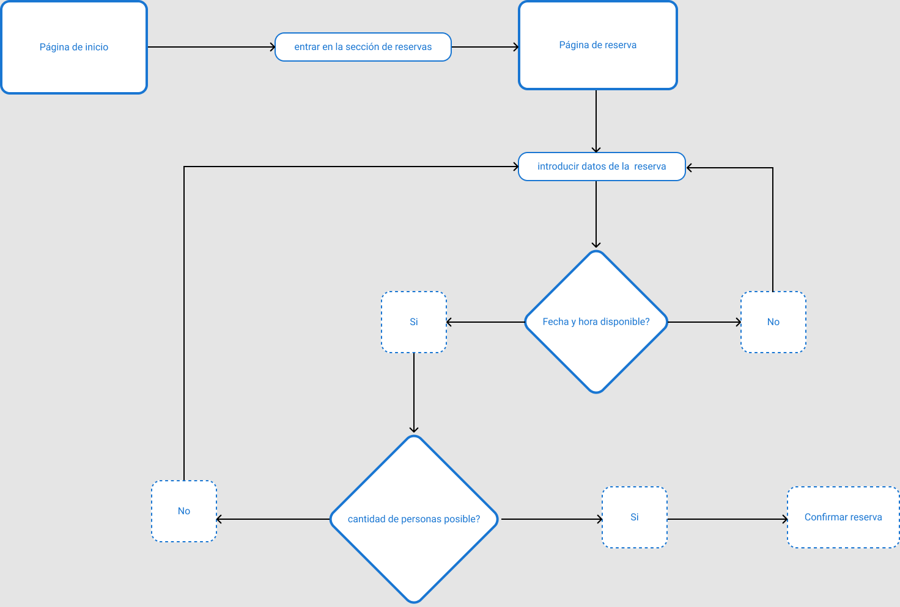
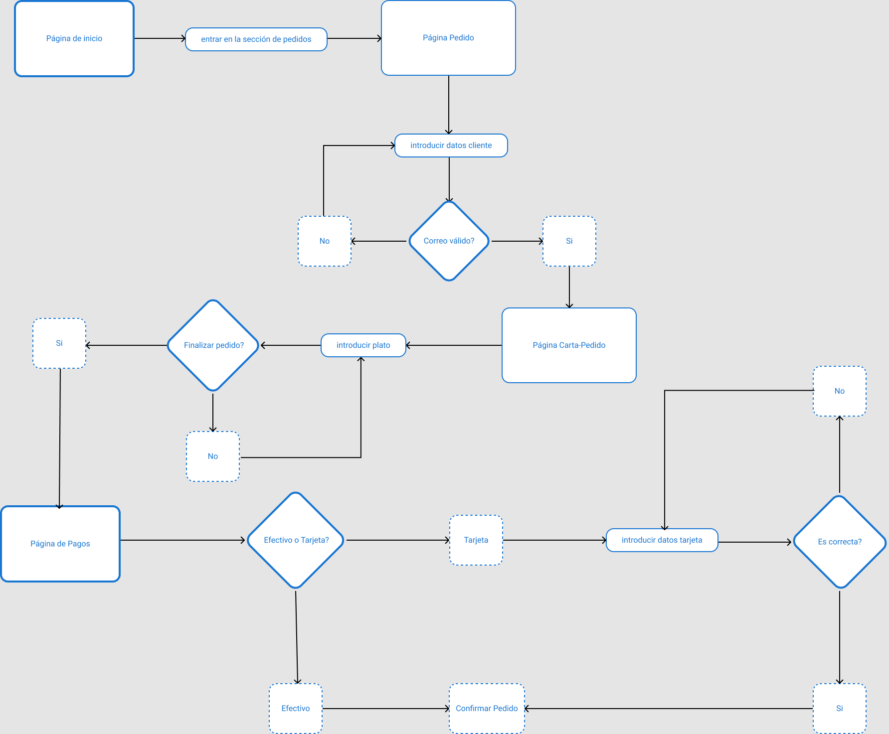
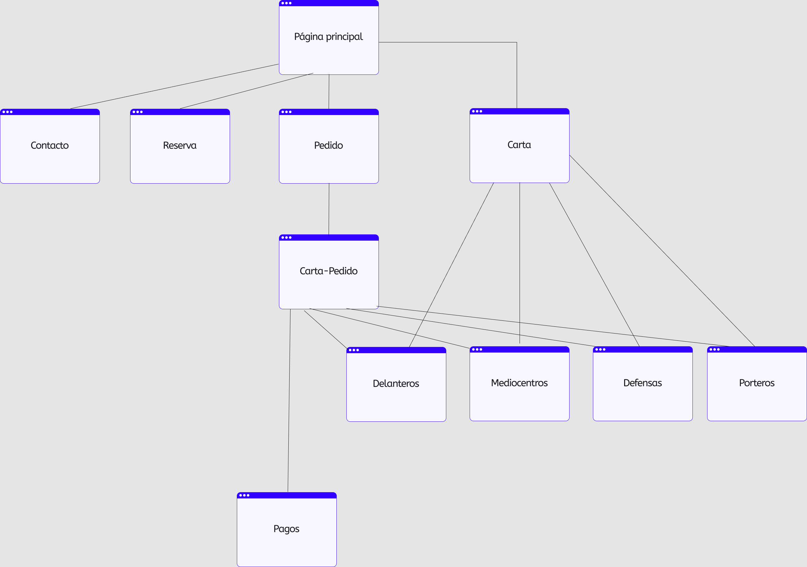

# DIU26
Prácticas Diseño Interfaces de Usuario (Tema: .... ) 

* [Guiones de prácticas](GuionesPracticas/)
* [Guía para crea tu Case Study](Guia_CaseStudy.md)
* Sala de la Fama [DIU Hall of fame](https://github.com/mgea/DIU/tree/master/hall_of_fame) donde se pueden encontrar Case Study destacados de otros años.
* [Recursos/plantillas en figma](https://www.figma.com/design/BN2IR0q2clOSplfMmalh9K/DIU_Toolkit_Framework--2026-)

Actualizado: 14/01/2026

## Paso 0 My UX-Case Study
 
-----
Grupo: DIU1.Los_visionarios.  Curso: 2025/26 

Nombre del Proyecto: Inazuma Ramen

Descripción: Restaurante de comida japonesa inspirado en el anime Inazuma Eleven

Logotipo: 

Pagina: [Inazuma Ramen](https://slide-act-38461346.figma.site/)

Miembros y nombre del equipo:
 * :bust_in_silhouette:  [Carlos Romero García](https://github.com/Cromgar939)   :octocat:     
 * :bust_in_silhouette:  [Manuel Martín Rodríguez](https://github.com/ManuelMR2114)     :octocat:

 

# Proceso de Diseño 

 

## Paso 1. UX User & Desk Research & Analisis 

### 1.a User Reseach Plan
 
-----
Queremos hacer un restaurante de comida japonesa inspirado en el anime Inazuma Eleven, utilizando un sistema de tubos neumáticos para la entrega de comida y ambientando el local y los platos en la serie. 

Hemos investigado la página de Sibuya para basarnos en su diseño. Nuestros objetivos se basan en satisfacer todas las necesidades del usuario de forma que no le resulte complicado entender la interfaz. Para ello vamos a investigar la experiencia de los usuarios relizando pedidos online y sobre el sistema de tubos neumáticos.

Para la investigación buscaremos usuarios mayores de edad y les pediremos que realicen tareas simples como realizar una reserva, realizar un pedido y pedir dentro del restaurante mediante el escaneo de un código QR.

### 1.b Competitive Analysis
 
-----
[Competitive Analysis](P1/CompetitorAnalysis.png)

Tras comparar la página web de Sibuya con la nuestra, la de Sibuya ofrece una experiencia tradicional mientras que la nuestra tiene un flujo guiado y una información concisa de forma que reduce la carga para el cliente. Queremos que todas las opciones a las que el usuario acceda recurrentemente (carta, reserva, pedido) estén en la página principal y sea fácilmente reconocibles, al contrario que la carta en Sibuya que se encuentra en un menú lateral un poco oculto.

### 1.c Personas
 
-----

[Persona 1: Evaristo González](P1/Persona1.png). Es un joven que maneja a la perfección internet y fan del anime que busca una experiencia orientada en sus serires favoritas para compartir con amigos.

[Persona 2: Alejandra Ortega](P1/Persona2.png). Una madre con poco manejo digital y su prioridad es la eficiencia y la claridad para que todo salga correctamente.

### 1.d User Journey Map
 
----

Para el [User Journey Map de Evaristo](P1/UserJourneyMapPersona1.jpg) hemos decidio poner la situación de una reserva, algo que es muy común en restaurantes.

Para el [User Journey Map de Alejandra](P1/UserJourneyMapPersona2.jpg) hemos decidido poner la situación de un pedido, cosa que es bastante común hoy en día.

### 1.e Usability Review
 
----

[Usability review](P1/Usability-review.pdf)

URL: https://sibuyaurbansushibar.com/restaurante-japones-granada/

Valoración: 89/100 -> Good

Puntos fuertes: colores impactantes, iconos reconocibles e instrucciones claras.

Puntos débiles: errores, menú lateral y función de búsqueda.

 

## Paso 2. UX Design  

### 2.a Reframing / IDEACION: Feedback Capture Grid / EMpathy map 
 
----
A partir del análisis de Sibuya en la P1, elaboramos una [Malla Receptora de Información](P2/feedbackCaptureGrid.png) y un [Mapa de Empatía](P2/EmpathyCustomerMapShibuya.png). Con esto, nos ponemos en los zapatos de nuestros clientes y sacamos que Shibuya presenta un diseño profesional, buena combinación de colores y una buena explicación de todo el contenido pero presenta una serie de desventajas: una carta cuya posición en la página web no es muy buena y sin precios visibles, buscador sin tolerancia a errores ortográficos, un límite de personas al realizar una reserva bastante reducido y datos que introducimos en la página no se quedan guardados en caso de error.

 Interesante | Críticas     
| ------------- | -------
  Preguntas | Nuevas ideas
  
Por lo tanto, Los usuarios abandonan el proceso de reserva o pedido por las desventajas comentadas antes. Nuestra propuesta consiste en crear una página web para Inazuma Ramen de forma que sea lo más sencilla de utilizar para el usuario. Nos centraremos en que toda la infomarción importante se muestre en todo momento y que las instrucciones para reservar y para realizar pedidos sean lo más claras posibles. Nos basaremos sobre todo en el número de reservas y de pedidos para comprobar si vamos por buen camino.

### 2.b ScopeCanvas

----

### 2.b User Flow (task) analysis 
 
-----
Hemos modelado dos operaciones principales que puede realizar el cliente:

**Primer Task Flow** — el usuario selecciona fecha, hora y número de personas. 
Si la reserva es posible se confirma; si no, se muestra un mensaje de error 
con el motivo.

**Segundo Task Flow** — el usuario introduce sus datos, recorre la carta añadiendo 
platos y finaliza seleccionando el método de pago. Si elige tarjeta, se validan 
los datos introducidos.

### 2.c IA: Sitemap + Labelling 
 
----
Con todo lo explicado en los puntos anteriores hemos creado nuestro sitemap

# Labelling
Término | Significado
| ------------- | -------
Pagina Principal | Página de inicio de Inazuma Ramen con acceso a las distintas secciones
Carta | Página para consular la carta
Pedido | Sección para realizar un pedido
Carta-Pedido| Página para consular la carta cuando el cliente vaya a realizar un pedido. 
Delanteros | Sección de la carta donde se encuentran los entrantes
Mediocentros | Sección de la carta donde se encuentran los platos principales
Defensas | Sección de la carta donde se encuentran los postres
Porteros | Sección de la carta donde se encuentran las bebidas
Pagos | Página para llevar a cabo el pago del pedido
Reserva | Página para realizar una reserva
Contacto | Sección donde se encuentra el correo y numero de teléfono de la empresa

### 2.d Wireframes
 
-----
Los wireframes han sido diseñados con **Figma** en dos versiones:

- [Wireframe fijo](P2/Wireframefijo.fig) con posiciones fijas absolutas y elementos en jerarquía de frames
- [Wireframe dinámico](P2/Wireframedinámico.fig) con un GRID LAYOUT con ajustes de diseño RESPONSIVE (Ordenador, Tablet y móvil)

Se han diseñado 6 pantallas principales: Página Principal, Carta, Reservas, Pedido, Pago y Contacto, teniendo en cuenta la aparición del teclado en tablet y móvil y el uso de la tablet en vertical y horizontal.

 

## Paso 3. Mi UX-Case Study (diseño)

### 3.a Moodboard

-----
Definimos el siguiente moodboard . 

### 3.b Landing Page
 
----

Hemos diseñado este 

Hemos utilizado como herramienta de apoyo FIGMA MAKE.

### 3.c Guidelines
 
----
Hemos definido el comportamiento y el diseño de los distintos componentes para nuestra página. Definiendo botones, tipográfia, Etiqueta, Layout, Imagenes..etc.

### 3.d Mockup
 
----
A partir del DESIGN SYSTEM descrito en el punto anterior, hemos creado nuestra página web con una navegación funcional. 

[Layout Hi-Fi](https://www.figma.com/proto/ljIgCD8RiohaodkAQ13woq/P%C3%A1gina?node-id=13-220&t=cEnkApVzRIxNLJwP-1&scaling=scale-down&content-scaling=fixed&page-id=0%3A1&starting-point-node-id=13%3A220)

 

## Paso 4. Pruebas de Evaluación 

### 4.a Reclutamiento de usuarios 

-----

Nos ha tocado como caso B la página web Goiko Experience del grupo DIU3-QBB cuyo enlace al github es: https://github.com/DIU3-QBB/UX_CaseStudy 
Los 5 primeros participantes son del Caso A y el resto del caso B

| ID Participante | Edad | Género | Competencia digital | Gafas/Lentillas | Iluminación | Resolución | Conocimiento previo | Rol |
|---|---|---|---|---|---|---|---|---|
| P01 | 21 | Hombre | Alta | Si | Natural | 1920x1080 | Medio | Estudiante |
| P02 | 20 | Hombre | Alta | No | Natural | 1920x1080 | Medio | Estudiante |
| P03 | 20 | Hombre | Alta | Si | Natural | 1920x1080 | Medio | Estudiante |
| P04 | 20 | Mujer  | Media | No | Natural | 1920x1080 | Ninguno | Estudiante |
| P05 | 16 | Hombre| Alta | Si | Natural | 1920x1080 |  Ninguno  |  Estudiante  |
| P06 | 19 | Mujer | Alta | No | Natural | 1920x1080 | Ninguno | Estudiante |
| P07 | 20 | Hombre | Alta | No | Artificial | 1920x1080 | Ninguno | Estudiante |
| P08 | 21 | Mujer | Media | Si | Artificial | 1920x1080 | Ninguno | Estudiante |
| P09 | 53 | Mujer | Baja | Si | Natural | 1920x1080 | Ninguno | Enfermera |
| P10 | 14 | Hombre | Alta | No | Natural | 1920x1080 | Ninguno | Estudiante |

### 4.b Diseño de las pruebas 
 
-----
Para evaluar ambas páginas y poder compararlas hemos hecho dos pruebas con cada participante. La primera consitía en simular la realización de una reserva, y la
segunda consistía en buscar el contacto de la página. Durante estas pruebas usamos GazeMapping para realizar un seguimiento de su mirada y comprobar si miraban los
puntos de interés asignados, además les medimos el tiempo que tardaban en realizar cada prueba. Por último hicieron el cuestionario SUS tras finalizar cada prueba.

### 4.c Cuestionario SUS
 
----
Para la realización de la reserva:

Podemos observar que tanto los tiempos tardados en ambas páginas como las puntuaciones dadas a cada pregunta son similares. De media obtenemos las siguientes puntuaciones:

- Inazuma Ramen: 98,5
- Goiko Experience: 93,5
- 
Con estos resultados podemos ver cómo prefieren realizar una reserva usando nuestro sitio web más que el otro.

Para buscar el contacto de la página: 

Podemos observar que aquí varían mucho más las puntuaciones, sobre todo el participante P09 tuvo más complicaciones para encontrar el contacto. De media obtenemos las siguientes puntuaciones:

- Inazuma Ramen: 96
- Goiko Experience: 75

Con estos resultados podemos ver cómo es más fácil de encontrar nuestro contacto que el otro.

### 4.d A/B Testing
 
-----

Las puntuaciones finales son las siguientes:

- Inazuma Ramen: 97,25
- Goiko Experience: 84,25

Con estas pruebas queda claro que Inazuma Ramen (caso A) es más fácil de usar y entender para todos los usuarios que Goiko Experience (Caso B), sobre todo por la simplicidad de la página mostrando toda la información importante y organizada de forma que el usuario no tiene que bajar en la página para encontrarla.

### 4.e Aplicación del método Eye Tracking 

----

Establecemos primero las pruebas que queremos realizar (hacer una reserva y consular el contacto de una página) y establecemos una serie de POI (Puntos de interés). A continuación, empleamos la herramienta Gazemapping para el Eye Tracking, calibrándola y dejamos que ella se encargue de recoger los datos de visión y clicks del usuario mientras realiza las pruebas que hemos establecido. Se guarda dicha información y se guarda el mapa de calor generado por el usuario, dándonos así la información de que se suele fijar más la gente o que menos a la hora de navegar por la página web y donde suelen hacer click. Y todo esto, lo comparamos con nuestros POI (Puntos de interés) establecidos

El reclutamiento ha sido a gente de nuestro entorno (amigos, compañeros, familiares), con distintos niveles de competencia digital de forma que podemos evaluar
correctamente la facilidad de uso de las páginas.

  

### 4.f Usability Report de B
 
-----

>>> Añadir report de usabilidad para práctica B (la de los compañeros) aportando resultados y valoración de cada debilidad de usabilidad. 
>>> Enlazar aqui con el archivo subido a P4/ que indica qué equipo evalua a qué otro equipo.

>>> Complementad el Case Study en su Paso 4 con una Valoración personal del equipo sobre esta tarea

Para finalizar la práctica hemos plasmado todos los datos recogidos en [Usability-Report](Usability-Report.md). 

 

## Paso 5. Exportación y Documentación 

### 5.a Exportación a HTML/React
 
----
Usando la herramienta Figma Make le hemos ido pasando prompts a la IA para que haga nuestra página funcional.

[Nuestra Página](https://slide-act-38461346.figma.site/)

 

## Conclusiones finales & Valoración de las prácticas

>>> Opinión FINAL del proceso de desarrollo de diseño siguiendo metodología UX y valoración (positiva /negativa) de los resultados obtenidos. ¿Qué se puede mejorar? Recuerda que este tipo de texto se debe eliminar del template que se os proporciona 

